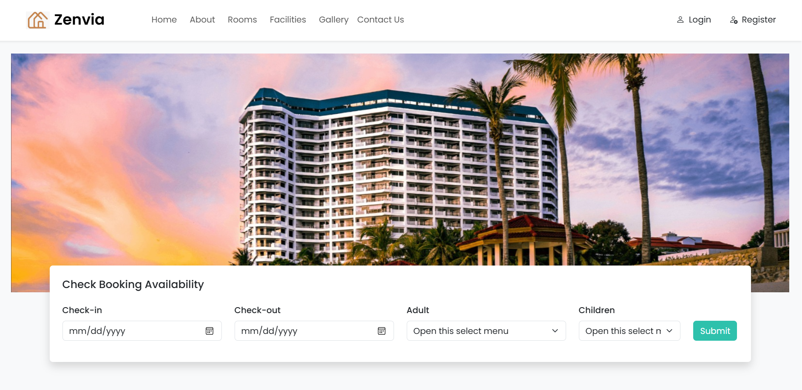

# 🏨 Hotel Reservation Website


## 📝 Project Description

A full-stack Hotel Reservation Web Application built using PHP, MySQL, and modern DevOps practices, designed to simulate a real-world production workflow including Version Control, CI Automation, and Cloud Deployment.

<div align="center">
  
</div>

## 📌 Project Overview

This project was developed as part of an academic and practical DevOps implementation to demonstrate:

- Real-world Git branching strategies
- Continuous Integration using GitHub Actions
- Cloud deployment on Render
- Full-stack PHP + MySQL architecture
- Team collaboration using professional workflows


## 👥 Group Information

| Name                  | ID              | Role               |
|:---------------------:|:---------------:|:------------------:|
| T.H. Imalsha Dilshani | ITBIN-2313-0027 | Frontend Developer |
| H.M. Imashi Dilshani  | ITBIN-2313-0025 | Backend Developer  |
| G. Rashmi Dulashani   | ITBIN-2313-0031 | DevOps Engineer    |

## 🌐 Live Deployment
**🔗 URL:** https://zenvia-czqm.onrender.com

The application is successfully deployed on Render cloud platform, enabling real-world hosting and accessibility.

## 🛠 Technologies Used
- **Frontend:** HTML5, CSS3, JavaScript, Bootstrap
- **Backend:** PHP, MYSQL
- **Version Control & CI/CD:** Git, GitHub, GitHub Actions
- **Deployment:** Render

## ✨ Features
- **User Registration & Login:** Secure authentication with MySQL database.
- **View Rooms:** Users can view available rooms.
- **Responsive UI:** Optimized for all device screens.

## 🌲 Branch Strategy
We implemented the following branching strategy to manage our collaboration:
- **main:** Production-ready code only (Protected branch).
- **develop:** Integration branch.
- **feature/*:** Individual branches for specific feature development.

## 👨‍💻 Individual Contribution

| Name                  | Responsibilities | 
|:---------------------:|:---------------|
| G. Rashmi Dulashani | - Repository setup and management <br> - GitHub Actions CI pipeline implementation <br> - Branch protection and workflow management <br> - Cloud Deployment on Render |
| T.H. Imalsha Dilshani | - Responsive UI development using HTML, CSS, JavaScript, Bootstrap <br> - Implemented dynamic forms and room display pages |
| H.M. Imashi Dilshani | - PHP backend development <br> - MySQL database design and integration |


## ⚡ Getting Started

### Prerequisites
- XAMPP or any PHP/MySQL server
- Git
- Web Browser

### Setup Instructions

#### 1. Clone the Repositary:
```bash
git clone https://github.com/RashmiDulashani/Hotel-Reservation-Website-DevOps
```
#### 2. Import Database
- Open phpMyAdmin
- Import database.sql

#### 3. Configure Database Connection:
- Update src/admin/inc/db_config.php with your MySQL credentials

#### Start Server
- Open XAMPP → Start Apache & MySQL
- Navigate to 
```bash
http://localhost/Hotel-Reservation-Website-DevOps/src
```

## ⚙️ Deployment & CI/CD Challenges

- Due to PHP and MySQL backend, deploying on static hosts like Vercel/Netlify is not supported.

- Deployment on Render faced configuration challenges.

## 📝 Future Enhancements

- Admin dashboard for managing users and rooms
- Online payment integration
- Email notifications for booking confirmation
- Analytics dashboard for admin
- Multi-language support

